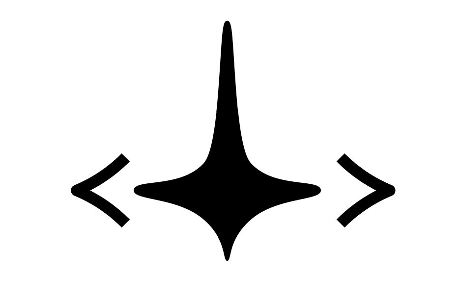

# Tron Webring

<p align="center">
  
</p>

## Overview

A webring for University of Waterloo Mechatronics Engineering students and alumni. Webrings link personal sites in a ring so visitors can discover more people in the community. Live site: https://tronring.com

This site supports prev/next navigation via URL hash routing (see the widget template below).

## How to Join

1. Add the webring widget to your site (template below). Put it in your footer or about page.
2. Fork this repo.
4. Add your info to `data/members.json` at the bottom of `sites[]`.
5. Make a commit, and push the commit to your fork.
6. Open a Pull Request.

### Entry format

```json
{
  "name": "Your Name",
  "website": "https://your-site.com",
  "url": "your-site.com",
  "class": "Class of 20XX",
  "description": ""
}
```

## Widget Template

Use `https://tronring.com` as the base URL.

### HTML

```html
<div style="display:flex;align-items:center;gap:10px;">
  <a href="https://tronring.com/#your-site.com?nav=prev" aria-label="Previous site">
    
  </a>
  <a href="https://tronring.com/#your-site.com" target="_blank" rel="noreferrer">
    
  </a>
  <a href="https://tronring.com/#your-site.com?nav=next" aria-label="Next site">
    
  </a>
</div>
```

### JSX

```jsx
<div style={{ display: "flex", alignItems: "center", gap: "10px" }}>
  <a href="https://tronring.com/#your-site.com?nav=prev" aria-label="Previous site">
    
  </a>
  <a href="https://tronring.com/#your-site.com" target="_blank" rel="noreferrer">
    
  </a>
  <a href="https://tronring.com/#your-site.com?nav=next" aria-label="Next site">
    
  </a>
</div>
```

## Assets

Files are in `public/` and can be used directly from the site root:

- `example.png` (widget demo)
- `leftarrow.png`
- `rightarrow.png`
- `logoblack.png`
- `logogreywhite.png`
- `tronblack.png`
- `tronorange.png`
- `tronorangeonblack.png`
- `trontransparent.png`
- `waterloo.png`

## Demo

<p align="center">
  
</p>

## Local Development

```bash
npm install
npm run dev
```

Build and run:

```bash
npm run build
npm run start
```

## Credits

Inspired by other UWaterloo program webrings and the broader webring community.

## Extras

if you're reading this and bored, feel free to check out https://github.com/sym7534/tron-webring/issues and try implementing something :)
